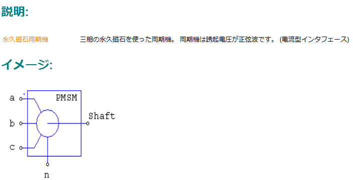

## PSIMにおけるPMSMの誘起電圧パラメータと永久磁石磁束との関係性
PSIMのライブラリにあるPMSMの永久磁石に関するパラメータは，$K_e\ [{\rm V_{p-p}/krpm}]$で定められている。これにより，モータの線間で発生する誘起電圧の実効値$V_{uv}$は，
$$
V_{uv} = \frac{K_e}{\sqrt{2}}\ [{\rm V_{rms}}]
$$
で与えられる。永久磁石磁束${\it \Psi_a}$と線間誘起電圧実効値の関係は，
$$
{\it \Psi_a} = \frac{\sqrt{3}V_{uv}}{2\pi f}
$$
である。ただし，$f$は誘起電圧の周波数。周波数とモータの回転数$N_m$の関係は，極対数を$P_n$としたとき，
$$
f = \frac{P_nN_m}{60}
$$
したがって，${\it \Psi_a}$と$K_e$の関係は，
$$
K_e = \sqrt{\frac{2}{3}}\cdot 2\pi f {\it \Psi_a}
= \sqrt{\frac{2}{3}} \frac{P_nN_m}{60}\cdot 2\pi {\it \Psi_a}
= \sqrt{\frac{2}{3}} \frac{2\pi\cdot 1000 \cdot P_n {\it \Psi_a}}{60} 
$$
で計算することができる。

